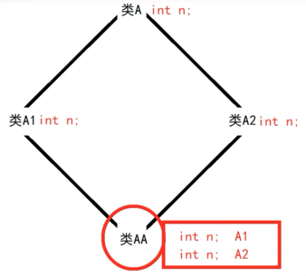

不影响原来的类，不改变原来的代码，实现堆功能的扩展
在原有类的基础上快速增加新的功能
#  1. 继承与派生
继承是在已有类的基础上，创建新的类的方式。
继承可以来源于多个类。
继承关系通常称之为 **父类** 与 **子类**，或者 **基类** 与 **派生类**。

继承与派生是同一个过程的两种描述方式。
从子类，从父类继承；从父类，子类是派生出的。

## 单继承
单继承只是继承一个父类，
语法格式：
```cpp
// class 父类名
class FatherClassName
{
};
// class 子类名： 继承权限 父类名
class SonClassName : privilege FatherClassName
{
};
```

## 多继承
多继承会继承多个父类:
语法格式：
```cpp
// class 父类名1
class FatherClassName1
{
};
// class 父类名2
class FatherClassName2
{
};

......

// class 子类名： 继承权限 父类名1,继承权限 父类名2... 继承权限 父类名n
class SonClassName : privilege FatherClassName1, ... privilege FatherClassNameN
{
};
```

## 继承权限：
继承权限有三类：
1. 公有继承 public
2. 私有继承 private
3. 保护继承 protected
与成员访问权限相似。

继承类是指子类继承父类的全部成员。

| 成员类型 | 公有继承 public | 私有继承 private | 保护继承 protected |
| ------- | --------------- | ---------------- | ------------------ |
| public  |  public         | private          | protected          |
| private |  不可访问      |  不可访问   |  不可访问           |
| protected| protected    |  private    |    protected      |

注意：私有成员只能在本类里进行访问，不能在子类里访问。

```cpp
class Father
{
public:
    Father(){}
    ~Father(){}
public:
    int publicNum;
    void PublicFunc(){
        cout << "PublicFunc" << endl;
    }
private:
    int privateNum;
    void PrivateFunc(){
        cout << "PrivateFunc" << endl;
    }
protected:
    int protectNum;
    void ProtectFunc(){
        cout << "ProtectFunc" << endl;
    }
};

class Son: public Father
{
public:
    Son(){}
    ~Son(){}
private:
};

// 在类外面访问的只能是public变量
int main()
{
    Son objSon;
    objSon.PublicFunc();    // 可以访问

    objSon.PrivateFunc();   // 访问不到
    objSon.ProtectFunc();   // 访问不到
    return 0;
}
```

```cpp
// 子类中类里面只能访问public和protected，private 无法访问
class Son: public Father
{
public:
    Son(){}
    ~Son(){}
    void TestFunction()
    {
        cout << protectNum << endl;     // 可以访问
        cout << publicNum << endl;      // 可以访问
        cout << privateNum << endl;     // 不可以访问
    }
private:
};
```
一般95%的场景使用公有继承，较少使用私有继承。

#  2. 父子关系
## 派生类的构成
继承除了构造函数、析构函数之外所有的成员函数与数据成员。构造、析构子类会被分配，所以不会构成。拷贝构造函数也不需要继承。
当父类的数据成员与子类的数据成员名称相同，发生冲突的时候，父类会直接屏蔽。
```cpp
class Father
{
public:
    Father();
    ~Father(){}
    int num;
};

Father::Father() {
    num = 50;
}

class Son: public Father
{
public:
    Son();
    ~Son(){}
    int num;
};

Son::Son() {
    num = 100;
}

int main()
{
    Son objSon;
    cout << objSon.num << endl;
    return 0;
}
```

输出：
```txt
100 
```

那如何能够访问父类的成员数据呢？
```cpp
int main()
{
    Son objSon;
    cout << "objSon.num = " << objSon.num << endl;
    cout << "Father class obj.num = " << objSon.Father::num << endl;
    return 0;
}
```
输出：
```txt
objSon.num = 100
Father class obj.num = 50
```
使用父类的类名，确定到底使用的是哪一个变量。
```cpp
class Father_1
{
public:
    Father_1();
    ~Father_1(){}
    int num;
};

Father_1::Father_1() {
    num = 50;
}

class Father_2
{
public:
    Father_2();
    ~Father_2(){}
    int num;
};

Father_2::Father_2() {
    num = 60;
}

class Son: public Father_1, public Father_2
{
public:
    Son();
    ~Son(){}
    int num;
};

Son::Son() {
    num = 100;
}

int main()
{
    Son objSon;
    // 加上父类的类名能指出具体能操作出什么样子
    cout << "objSon.num = " << objSon.num << endl;
    cout << "Father_1 class obj.num = " << objSon.Father_1::num << endl;
    cout << "Father_2 class obj.num = " << objSon.Father_2::num << endl;
    return 0;
}
```
输出：
```txt
objSon.num = 100
Father_1 class obj.num = 50
Father_2 class obj.num = 60
```

## 派生类的对象
派生类的对象可以当作基类对象来使用.
```cpp
class Father
{
public:
    Father(){}
    ~Father(){}
    int num;
};

class Son: public Father
{
public:
    Son(){}
    ~Son(){}
    int num;
};

int main()
{
    Father obj_Father;
    Son obj_Son;

    obj_Father = obj_Son;       // 可以，允许，父类对象可以接受子类对象的值
    obj_Son = obj_Father;       // 不可以，不被允许，子类对象无法接受父类对象的值

    Father *pFather = &obj_Son;     // 可以，允许，父类指针指向子类对象
    Son *pSon = &obj_Father;        // 不可以，不被允许，子类指针不可以指向父类对象
    return 0;
}
```
结论：子类对象可以给父类对象赋值，父类对象不可以给子类对象赋值；
     父类对象可以指向子类指针，子类对象不可以指向父类指针。
子类指针读父类对象，子类读取范围大于父类对象，因此不可以。

## 派生类的构造析构函数
```cpp
class Father
{
public:
    Father() { cout << "Father Constructor" << endl; }
    ~Father() { cout << "Father Destructor" << endl; }
    int num;
};

class Son: public Father
{
public:
    Son() { cout << "Son Constructor" << endl; }
    ~Son(){ cout << "Son Destructor" << endl; }
    int num;
};

int main()
{
    Son obj_Son;
    obj_Son.num = 0;
    cout << "obj_Son.num = " << obj_Son.num << endl;
    return 0;
}
```

输出：
```txt
Father Constructor
Son Constructor
obj_Son.num = 0
Son Destructor
Father Destructor
```

#  3. 菱形继承



```cpp
class A
{
public:
    int a;
};

class A1: public A
{
public:
    int a1;
};
class A2: public A
{
public:
    int a2;
};

class AA: public A1,public A2
{
public:
    int aa;
};

int main()
{
    AA obj_aa;
    obj_aa.aa;
    obj_aa.a1;
    obj_aa.a2;
    obj_aa.a;       // 不可访问
    obj_aa.A::a;    // 不可访问
}
```

使用虚继承可以根治 菱形继承导致的数据成员冗余的方法。
```cpp
class A
{
public:
    int a;
};

class A1: virtual public A          // 虚继承
{
public:
    int a1;
};
class A2: virtual public A          // 虚继承
{
public:
    int a2;
};

class AA: public A1,public A2
{
public:
    int aa;
};

int main()
{
    AA obj_aa;
    obj_aa.aa;
    obj_aa.a1;
    obj_aa.a2;
    obj_aa.a;       // 可以读取
}
```
使用虚继承，子类将会只有一份来最原始父类的继承。